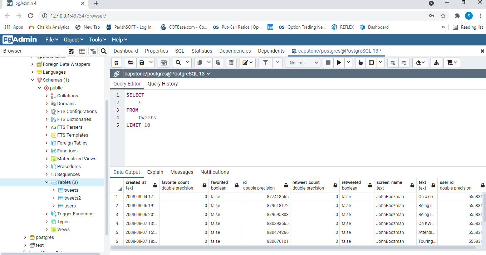

# Political Tweet Analysis - by Sanjay Shah  
### The purpose of this project was to analyze a data set of political tweets and to develop/improve database and SQL skills.  
### A historic data set was used which ranged from 2008 through 2017.  
## Data Engineering  
### A local postgresql database was created for the data.  I used a python connection to load the csv file into the database.  
## Analysis  
### Analysis was conducted in the Jupyter Notebooks.  Data was imported into the Juypter Notebook and cleaned before performing exploratory analysis
### and descriptive statistics.  Topic analysis was conducted using an LDA model.  
## Files
### 
* CongressionalTweetAnalysis.pdf - Summary presentation
* ERD.jpg - Entity Relationship Diagram for the local postgresql database
* database_sql_load.ipynb - python code to load the postgresql database with data from the csv
* descriptive_stats.ipynb - descriptive statistics for exploratory analysis
* tweet_counts.ipynb - tweet counts by user
* tweet_topic_analy_single_user.ipynb - topic analysis script for a single user
* topic_analysis.ipynb - topic analysis notebook  
## Learning about SQL  
## My general process was to develop the SQL query templates using the visual interface in PGADMIN and then copy over to python.  
## Once in Python, I utilized string formatting to make the queries dynamic.  

